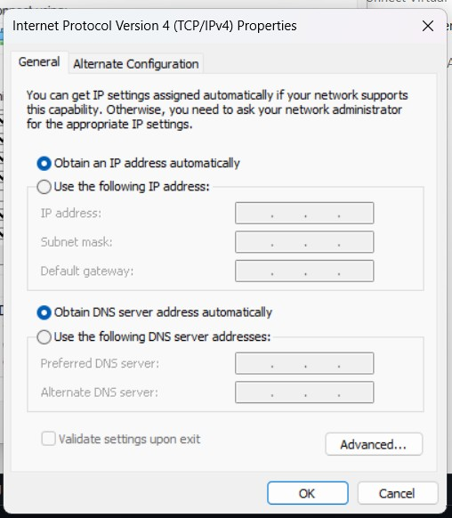

## Introduction
The FLIR A400 is an advanced fixed-mount thermal camera intended for automation, research, and industrial monitoring. It offers flexible integration with external systems, real-time streaming via GigE/RTSP, and high-resolution infrared imaging. The A400 is perfect for tasks like condition monitoring, thermal inspection, process control, and research experiments because it is designed for continuous operation and network connectivity, unlike handheld thermal cameras.

This repository details a useful procedure for setting up the FLIR A400 on ROS2 (Linux/WSL2) and Windows (using FFmpeg). It covers ROS2 integration, dataset capture, live video streaming, and installation. The objective is to offer a practical, step-by-step manual, bridging the gap left by the paucity of official documentation and internet blogs.

Note: There aren't many excellent blogs or videos available, and FLIR's documentation is disjointed, or it could be I did not find them. These are the actions that I found to be effective.

## Softwares
The first thing I started to work with was installing Spinnaker SDK from Teledyne's website which provides the actual driver + API libraries + Python bindings. SpinView is the name of the the GUI application and it comes with the SDK installer as an optional component. It’s basically a quick way to view streams and tweak camera settings without coding. 


https://www.teledynevisionsolutions.com/products/spinnaker-sdk/?model=Spinnaker%20SDK&vertical=machine%20vision&segment=iis

During the Installation:
- After running the installer, SDK+Drivers are always default.-
- Checking the Spinview, PySpin (Python bindings) and GUI is recommended.
- After finishing the installation, laptop or pc should be booted.
- Now, spinView should appear in the Start Menu---> fLIR systems and the camera should appear in Device Manager. 

If you have all the cables and componenets of the FLIR camera set up tools or starter kits, then you are golden. However, I only got the FLIR a400 itself and M12 to RJ45 Adapter. To make it work with my laptop, I had to order some cables. 
>	POE: Gigabit PoE+ Injector 30W IEEE802.3at/af Compliant, Supplies PoE(15.4W) or PoE+(30W) Power Over Ethernet Distances Up to 328ft, PoE Injector Adapter for Camera/Access Point/IP Phones
>	NETGEAR 5-Port Gigabit Ethernet Unmanaged Essentials Switch (GS305P) - Home Network Hub, Office Ethernet Splitter, Plug-and-Play, Silent Operation.
>	X-Code-RJ45-Industrial-Shielded-Ethernet M12 8 Pin X-Code Male to RJ45 Cat6a Ethernet Shielded Cable for Cognex Industrial Camera Flexible 3.3Ft|1M
>   UGREEN USB to Ethernet Adapter, 1000Mbps Plug and Play Ethernet Adapter with USB 3.0, Driver Free, RJ45 LAN Network Dongle Compatible with Nintendo Switch, Laptop, PC, MacBook, Windows, macOS, Linux

## Hardware Set Up:
The connection chain:
Laptop--> UGREEN USB to Ethernet Adapter--> Cat6 cable-->NETGEAR 5-Port Gigabit Ethernet Switch (GS305P)
Flir A400--> NETGEAR 5-Port Gigabit Ethernet Switch (GS305P). 
Camera has blue light blinking and the green light, also on Gigabit Ethernet Switch (GS305P), and the switch ports light up green when connected properly. 

## Making the camera talk to the laptop:
1. Find camera IP address:
CMD method:
```
 Win + R --> type "cmd" --> Enter --> ipconfig
```

It should look like this:
```
IP address: 1xx.1xx.1.50   (your laptop)
Subnet mask: 255.255.255.0
Gateway: leave blank           
```
2. Note your IPv4 address (e.g., 192.168.1.50) under "Ethernet adapter." This is the Ethernet network's IP address for your laptop. For streaming to function, the FLIR A400 camera needs to be configured to a compatible address (same subnet, such as 192.168.1.100). IPv4 is what most GigE/RTSP devices (like the FLIR A400) expect.


## 3. tools:
-Install FLIR IPConfig 3.5. After Instalaltion it should show the camera's IP address.
    <p align="center">
  
    </p>
-If it does not show it, then try Advanced IP Scanner, another software for finding IP addresses of devices. I had issue with both of these. I had to look for third option for fiiding out the IP address of the camera. 
-WireShark, I managed to find the IP address using this software. Just install, select the ethernet showing up and it will find all the addresses. The one that looks promising or differant then the rest can be the IP address we need. Example: You might see 192.168.1.100 pop up, while your laptop is 192.168.1.50.
-Write down this camera IP — you’ll need it for FFmpeg or ROS2 streaming.

Sometimes you want to assign an IP address, or the camera doesn't automatically capture one.
- Launch Run → ncpa.cpl, which displays Network Connections.
- Locate your GigE adapter, also known as an ADX adapter or GigE Vision adapter.
- Right-click → Properties → Go to Properties → Internet Protocol Version 4 (TCP/IPv4).

   <p align="center">
  
   </p>

Cautions:
- Always keep the third number block the same (1xx.1xx.0.x) for both laptop and camera → that’s the subnet.
- nly the last digit should differ (e.g., .2 vs .10).
- If you assign them identical IPs, neither will work.
   
After I find the camera in the SpinView, I forced all IP address to follow my laptop's IP address. I could not change it through FLIR -IPConfig 3.5, so I had to brute force it. 
# Reminder: I had to go through all these hassles, because the FLIR ipconfig was not working, nothing was showing up on spinView either. If you do not have hard luck like mine, then the official FLiR IPConfig should find the IP address of the camera and you can change it to your IP address. And boom, it is done!!

## Raw Data Collection:
- I had VLC on my laptop. I wanted to use it for camera streaming.
```
vlc--> open network stream--> rtsp://169.254.79.239/avc?ch0 or rtsp://169.254.79.239/avc/ch1 (should be your IP) --> Play
```
To record:
```
vlc--> convert\save--> Network ( rtsp://169.254.79.239/avc?ch0 or rtsp://169.254.79.239/avc/ch1 )--> convert/save --> Video - H.264 + Mp3 (MP4)--> Destination file --> browse anywhere youw want and give it a name. The video should be recodred and saved in the folder you saved.
```
- Install FFmpeg: 
Windows: Download FFmpeg build--> unzip --> add the bin/ folder to your PATH.
```
sudo apt update
sudo apt install ffmpeg
```

Run this in Command Prompt / Terminal (Use your camera’s IP):

Preview steram:
```
ffmpeg -i rtsp://192.168.0.2/avc?ch=0 -f sdl "FLIR_A400_Stream"
```
Record raw video:

```
ffmpeg -i rtsp://192.168.0.2/avc?ch=0 -c copy thermal_recording.mp4
```
>To use each frame as an image:
```
ffmpeg -i rtsp://192.168.0.2/avc?ch=0 -qscale:v 2 frames/frame_%04d.jpg
```
#
Note: pip install ffmpeg or pip install ffmpeg-python does not install FFmpeg itself. You still need the standalone FFmpeg binary on your system (Windows: download zip from gyan.dev
; Linux: sudo apt install ffmpeg). Once installed, you can optionally use the Python bindings if you want to call FFmpeg from scripts.

But I did it, I did not have Linux then. 
```
pip install ffmpeg-python
```
CMD:

```
ffmpeg -i rtsp://192.168.0.2/avc?ch=0-c:v libx264 -preset veryfast -crf 23 -c:a aac output.mp4
```

1. -i rtsp://192.168.0.2/avc?ch=0 => the input RTSP stream from the camera (rtsp://192.168.x.2/avc?ch=0 = camera’s IP).
2. -c:v libx264 => encode video with H.264 (widely compatible, efficient).
3. -preset veryfast => speeds up encoding (bigger files, but good for live recording).
4. -crf 23 => sets quality (lower = better quality & bigger file, higher = more compressed).
5. -c:a aac => encodes audio in AAC (safe even if the stream has no audio, avoids errors).
6. output.mp4 => saves the recording to a file.


